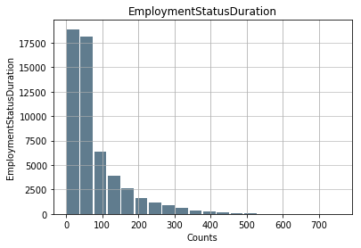

```{r, include=FALSE}
library(knitr)
```


### Abstract

In this project, I created a classification model which predicts, from borrower demographic information and company-provided loan conditions and ratings, whether a peer-to-peer loan will be repaid, or not.  To this end, I compared labeled historical Prosper loan data to the repayment status predicted by several supervised learning algorithms.  The original dataset includes 113,937 loans, with 81 features per loan, including loan amount, interest rate, demographic information, and actual historical loan status.  This information is particularly important for prospective peer-to-peer lenders, for the purpose of determining whether to lend money to a particular borrower.  It is also important for the company, towards determining: whether to offer a potential borrower a loan; which terms to offer; and what risk category to assign to a borrower (although this particular model is geared towards potential lenders).

## I. Definition
<!--_(approx. 1-2 pages)_-->

### Project Overview
<!--In this section, look to provide a high-level overview of the project in layman’s terms. Questions to ask yourself when writing this section:
- _Has an overview of the project been provided, such as the problem domain, project origin, and related datasets or input data?_
- _Has enough background information been given so that an uninformed reader would understand the problem domain and following problem statement?_-->

The main problems to be solved for any lending business are determining whether to offer a given borrower a loan, what amount is safe to lend them, and what interest rate to charge them.  Peer-to-peer lending companies offer loans, under company-determined terms, to potential borrowers, and then allow private individuals signed up with the service to choose whether to contribute to funding the loan (e.g., a private individual can choose to contribute 5%, or any other portion of the loan amount to a given borrower).  In contrast to traditional lending institutions, these companies have the additional problem of determining how to accurately present loan risk (i.e., risk of non-payment or defaulting) to potential lenders.

In the context of peer-to-peer lending, the company must determine, on the basis of background financial and demographic information, the requested loan amount, and other factors, whether to extend a loan to a potential borrower.  Potential lenders, on the other hand, must decide whether they're willing to lend an approved borrower money.  For these lenders, an accurate assessment of risk is very useful, and as I point out in my previous exploration of this data, found [here](https://eskrav.github.io/udacity-data-analyst/explore-and-summarize/explore-and-summarize.html), Prosper tends to substantially overestimate potential lender profit, and may underestimate the likelihood of default.

Given that we have a large database of historical information on repaid or defaulted loans, this is fertile ground for building a supervised learning model, geared towards potential peer-to-peer lenders, which can predict repayment status, although a version of this model may also assist a lending company in deciding who to offer a loan to in the first place, and on what terms.  My personal motivation in this project is to systematically investigate a rich and complex data set which I have previously worked with, to see if I can gain additional insight into some of the qualitative patterns I observed.  I would have liked to see if I could improve on Prosper's less formal predictions of repayment likelihood -- but this is difficult to compare directly, as Prosper assigns risk scores, rather than likelihoods of repayment.

There have been many previous attempts at building models to assist lenders in deciding whether, and how much to invest.  Published models use deep learning methods [@DBLP:journals/corr/abs-1810-03466; @DBLP:journals/corr/abs-1811-06471], coordinate descent [@DBLP:journals/corr/BelletGTT17], and a wider variety of models tackle credit worthiness in general^[See https://www.moodysanalytics.com/risk-perspectives-magazine/managing-disruption/spotlight/machine-learning-challenges-lessons-and-opportunities-in-credit-risk-modeling for an overview.].  As the last source discusses, Random Forest and Boosting algorithms are particularly well-suited to this problem, due in part to their flexibility and greater ability to capture non-linear relationships.


### Problem Statement
<!--In this section, you will want to clearly define the problem that you are trying to solve, including the strategy (outline of tasks) you will use to achieve the desired solution. You should also thoroughly discuss what the intended solution will be for this problem. Questions to ask yourself when writing this section:
- _Is the problem statement clearly defined? Will the reader understand what you are expecting to solve?_
- _Have you thoroughly discussed how you will attempt to solve the problem?_
- _Is an anticipated solution clearly defined? Will the reader understand what results you are looking for?_-->

The specific problem I am then aiming to solve is predicting, from information provided at the outset by a peer-to-peer lending company, whether a loan will be repaid, or not.  This can be accomplished in terms of providing a probability of repayment, or a categorical prediction of whether the loan will be repaid.  As the end status of historical loans is known in this case, these can be used to train predictive models, whose power can then be tested on a remaining subset of the data. 

To this end, I built several classification models which predict whether a loan will ultimately default, or be repaid.  The predictive power of each models i evaluated using the metrics detailed in the next section.  As the historical loan dataset contains a large number of features, many of which are correlated with one another, I also attempt to simplify the feature set by using Principal Component Analysis (PCA) for dimensionality reduction, selecting either the top 3 most important features (with the top 3 accounting for most of the variance), or the top 10.  I similarly select either the top 10% of the most important features (those that account for the most variance), or the top 30%.

The techniques I use are largely those accepted in determining credit risk -- namely, ensemble methods such as random forests and boosting algorithms (in my case, AdaBoost and XGBoost).  I also use Logistic Regression, as the easily interpretable results, which give the likelihood that a particular loan will be repaid, make it an attractive method.  I use a grid analysis to determine optimal parameterization of the two more promising models, chosen on the basis of model performance (with default settings) on the training and test datasets.

### Metrics
<!--In this section, you will need to clearly define the metrics or calculations you will use to measure performance of a model or result in your project. These calculations and metrics should be justified based on the characteristics of the problem and problem domain. Questions to ask yourself when writing this section:
- _Are the metrics you’ve chosen to measure the performance of your models clearly discussed and defined?_
- _Have you provided reasonable justification for the metrics chosen based on the problem and solution?_-->

The evaluation metrics I am primarily concerned with are the following, with a particular focus on precision, as we want to make sure that a maximum number of those loans labeled as completed/repaid are, in fact repaid, even if this results in some completed loans being labeled as defaulted.

Recall calculates how many of the completed loans are in fact labeled as completed.  A naive classifier may label all historical loans as completed, resulting in perfect recall -- but this would result in lenders contributing to loans highly likely to default, and potentially losing large sums of money.

$$Recall = \frac{\text{True Positive}}{\text{True Positive} + \text{False Negative}}$$

Precision calculates how many of those loans labeled completed are, in fact, completed (as opposed to defaulted).  As mentioned, this would appear to be the metric of most interest, as we are most concerned with avoiding loans likely to default.  It is then intuitively preferable that, all else being equal, a lender forego investing in a loan that would pay off, than invest in a loan that will default:

$$Precision = \frac{\text{True Positive}}{\text{True Positive} + \text{False Positive}}$$

The F1 score seeks a balance between recall and precision.  All else being equal, a higher F1 score is still preferable, given that lenders should be able to identify loans likely to pay off as such -- and while some degree of risk aversion is healthy, lenders must also have sufficient opportunities to earn money:

$$F1 = 2 \cdot \frac{\text{Precision} \cdot \text{Recall}}{\text{Precision} + \text{Recall}}$$


## II. Analysis
<!--_(approx. 2-4 pages)_-->


### Data Exploration
<!--In this section, you will be expected to analyze the data you are using for the problem. This data can either be in the form of a dataset (or datasets), input data (or input files), or even an environment. The type of data should be thoroughly described and, if possible, have basic statistics and information presented (such as discussion of input features or defining characteristics about the input or environment). Any abnormalities or interesting qualities about the data that may need to be addressed have been identified (such as features that need to be transformed or the possibility of outliers). Questions to ask yourself when writing this section:
- _If a dataset is present for this problem, have you thoroughly discussed certain features about the dataset? Has a data sample been provided to the reader?_
- _If a dataset is present for this problem, are statistics about the dataset calculated and reported? Have any relevant results from this calculation been discussed?_
- _If a dataset is **not** present for this problem, has discussion been made about the input space or input data for your problem?_
- _Are there any abnormalities or characteristics about the input space or dataset that need to be addressed? (categorical variables, missing values, outliers, etc.)_-->

The original dataset can be found here: https://s3.amazonaws.com/udacity-hosted-downloads/ud651/prosperLoanData.csv

I previously cleaned and performed an exploratory analysis of this dataset for the Udacity Data Analyst Nanodegree: https://eskrav.github.io/udacity-data-analyst/explore-and-summarize/explore-and-summarize.html.  This is a very large historical dataset of peer-to-peer loans, including background financial and demographic information on borrowers, the risk status and expected lender yield indicated by Prosper itself, and most importantly, information on whether past loans were in fact repaid, or not.  The dataset contains information on 113,937 loans, with 81 continuous or categorical features per loan.

In this project, I use a slightly modified version of the dataset, which is generated by the following R code, and which has already been cleaned and organized substantially: https://github.com/eskrav/udacity-data-analyst/blob/master/explore-and-summarize/explore-and-summarize.Rmd.  I use the attached Jupyter notebook to further clean and modify the dataset for use in this project.

### Exploratory Visualization
<!--In this section, you will need to provide some form of visualization that summarizes or extracts a relevant characteristic or feature about the data. The visualization should adequately support the data being used. Discuss why this visualization was chosen and how it is relevant. Questions to ask yourself when writing this section:
- _Have you visualized a relevant characteristic or feature about the dataset or input data?_
- _Is the visualization thoroughly analyzed and discussed?_
- _If a plot is provided, are the axes, title, and datum clearly defined?_-->

For a more complete visual exploration of this data, the following document should be consulted: [Explore and Summarize Data](https://eskrav.github.io/udacity-data-analyst/explore-and-summarize/explore-and-summarize.html#final_plots_and_summary).  In this section I will point out a small number of the patterns that I previously found.

As can be seen in Figure 1, some features in this dataset, including the  rating Prosper itself assigns to loans, are quite clearly predictive of final repayment status:

```{r fig1, echo=FALSE, fig.cap="Loan Repayment by Prosper Rating", out.width = '75%'}

```

This is information explicitly provided by the lending company, for the purpose of helping the potential lender decide whether a borrower is trustworthy.  Although these loan ratings are by no means perfectly predictive, it is clearly the case that the higher the rating assigned by the company, the higher the likelihood of loan repayment.

Other features are not specifically designed by the company to be predictive of loan repayment, but yet are quite informative, as can be seen in Figure 2:

```{r fig2, echo=FALSE, fig.cap="Loan Repayment by Income Range", out.width = '75%'}
knitr::include_graphics("incomerange.png")
```

Here, one can clearly see that the more the potential borrower earns, the more likely they (unsurprisingly) are to replay the loan.

More visualizations of how various features in the dataset correlate with likelihood of loan completion, and higher returns for the lender, can be found on this page: https://eskrav.github.io/udacity-data-analyst/explore-and-summarize/explore-and-summarize.html#lender_profit.  In summary, Prosper's own ratings and loan terms are highly predictive of repayment status, as are reports of previous on-time Prosper payments.  Similarly, demographic and background financial information such as occupation, income bracket, credit score, employment status, recent credit inquiries, delinquent loans, and debt-to-income ratio, appear to be predictive.

### Algorithms and Techniques
<!--In this section, you will need to discuss the algorithms and techniques you intend for solving the problem. You should justify the use of each one based on the characteristics of the problem and the problem domain. Questions to ask yourself when writing this section:
- _Are the algorithms you will use, including any default variables/parameters in the project clearly defined?_
- _Are the techniques to be used thoroughly discussed and justified?_
- _Is it made clear how the input data or datasets will be handled by the algorithms and techniques chosen?_-->

For this task, I slected three Ensemble methods commonly used for the task of classification - one averaging method (Random Forest), and two boosting methods (AdaBoost and XGBoost).  I also selected Logistic Regression, as having an output of probabilities allows for more interpretability, as well as flexibility after the fact in setting thresholds for decisions.  I broadly retain some of my previous descriptions of these algorithms, where I have previously used them.  All of these models are initially evaluated on training and test data using their default settings.  The models with the most promising metrics are then further optimized.

For strengths and weaknesses of the relevant models, I primarily consulted the following sources, keeping in mind that heuristics do not necessarily apply to each data set:

- https://medium.com/@randylaosat/machine-learning-whats-inside-the-box-861f5c7e72a3
- https://medium.com/@vijaya.beeravalli/comparison-of-machine-learning-classification-models-for-credit-card-default-data-c3cf805c9a5a
- https://www.dummies.com/programming/big-data/data-science/machine-learning-dummies-cheat-sheet/
- https://hackernoon.com/boosting-algorithms-adaboost-gradient-boosting-and-xgboost-f74991cad38c
- https://medium.com/@grohith327/gradient-boosting-and-xgboost-90862daa6c77

##### Random Forest

Random Forest models average across multiple decision trees in order to correctly classify points, and frequently outperform other methods on accuracy.  This model natively handles categorical variables, and is less prone to overfitting than a single decision tree -- it is therefore more likely to select relevant features.  These features make this model a good candidate for this problem, which has numerous categorical and continuous features.  Given that after one-hot conversion, there were 88 total features, a model which will automatically select the most important features is of particular importance.  Additionally, Random Forest models can handle imbalanced data, as is found in this dataset.  Overall, this is a flexible algorithm that does not require a lot of parameter tuning.

The weaknesses of this model are that it doesn't tend to perform well with a bad set of features, it's not very transparent, and it's hard to interpret what's going on in the algorithm. Further, too many trees can slow down the algorithm.

##### Logistic Regression

Logistic regression calculates the probability that a given point belongs to any given category.  The strengths of this model are that it's fairly easy to interpret in terms of probabilities, is relatively unlikely to overfit, is fast, and is well-suited for binary classification tasks.  Further, explanatory variables can be either continuous or categorical.  These features, and in particular the fact that results are couched in terms of probabilities, make this model an attractive candidate for this problem, given that probabilities allow for post-hoc adjustment of the threshold for whether a lender should fund a particular loan, perhaps depending on their personal finances or risk aversion.

The downsides of this model are that it's not particularly good at capturing complex or non-linear relationships between features, or dealing with multiple/non-linear decision boundaries.  Unlike the remaining Ensemble methods, which use decision trees, it does not deal naturally with multicollinearily -- redundant or highly correlated predictors, of which there are many in this dataset -- may throw this algorithm off (and ideally, would have been removed; however, PCA is another method of dealing with this).  Generally, it's not very flexible.

##### AdaBoost

AdaBoost, which is explained further in the attached Jupyter notebook (omitted here for brevity), is an ensemble method particularly well-suited to boosting the performance of decision trees on binary classification tasks.  It typically does not overfit despite excellent accuracy (although it is to date unclear exactly how), and frequently outperforms other methods.  These features make it a good model to attempt for this problem, given that the algorithm can be used to boost the performance of classifiers which work well natively with categorical data, such as decision trees, and like random forests will automatically select those features that are most important.  It additionally does not require variable transformation, and has relatively few parameters that need tweaking.

The weaknesses of this model are that it does not deal well with noisy data, and the efficiency of the algorithm is affected by outliers, since the algorithm attempts to fit each point.

##### XGBoost

XGBoost, which is explained further in the attached Jupyter notebook (omitted here for brevity), is highly robust to irregularities in data, and like AdaBoost, is a boosting algorithm which tries to create a strong classifier from a series of weaker classifiers, and which frequently outperforms other methods in competitions.  It additionally natively handles missing data.  Given that the dataset I have is quite noisy, with quite a bit of missing or imputed data, and is particularly suited to decision trees, this is an appropriate algorithm to attempt.

### Benchmark
<!--In this section, you will need to provide a clearly defined benchmark result or threshold for comparing across performances obtained by your solution. The reasoning behind the benchmark (in the case where it is not an established result) should be discussed. Questions to ask yourself when writing this section:
- _Has some result or value been provided that acts as a benchmark for measuring performance?_
- _Is it clear how this result or value was obtained (whether by data or by hypothesis)?_-->

A benchmark model I would like to use is the following analysis, which ended up using a Random Forest classifier: @schnessl_2017.  I was not able to immediately locate any other analysis using the same dataset, or reasonably current Prosper loan data.  However, this analysis attempts to predict defaults, rather then completions, making it difficult to directly compare metrics.  An alternative benchmark I use in the attached notebook is a naive classifier which labels all loans as completed (100% recall, low precision); the minimum standard then would be to improve precision.

An alternative benchmark is the following project, which uses LendingClub data: @TsaiRamiahSingh.  This project achieves highest performance using a Logistic Regression model, with precision (given the default $\beta$=1) at 0.89, but fairly low recall at only 0.64, meaning that it does not label a large portion of completed loans as completed (meaning that customers are missing out on potential profits, and aren't investing in as many loans)^[This model produces much higher precision at higher $\beta$ values, but at its optimal precision of 0.96 labels only 7.9% of completed loans as such.].  Another analysis, which similarly uses LendingClub data, and achieves highest performance using a Random Forest model, arrives at a weighted precision and recall of 0.89, which appears more promising: @LiHan.

Although these datasets are not directly comparable, this provides some estimate of how high a performance may in principle be achieved.

## III. Methodology
<!--_(approx. 3-5 pages)_-->

### Data Preprocessing
<!--In this section, all of your preprocessing steps will need to be clearly documented, if any were necessary. From the previous section, any of the abnormalities or characteristics that you identified about the dataset will be addressed and corrected here. Questions to ask yourself when writing this section:
- _If the algorithms chosen require preprocessing steps like feature selection or feature transformations, have they been properly documented?_
- _Based on the **Data Exploration** section, if there were abnormalities or characteristics that needed to be addressed, have they been properly corrected?_
- _If no preprocessing is needed, has it been made clear why?_-->

The pre-processing steps can be viewed in more detail in this file: https://github.com/eskrav/udacity-machine-learning/blob/master/capstone-project/capstone_project.ipynb.  The data that I imported was already pre-cleaned, explored, and summarized, as previously detailed.  

All current loans had already been removed from the dataset, as I was solely interested in historical loans which had already been repaid, or defaulted.  The few historical cancelled loans had been removed from the data, as they do not result in any gain or yield for the lender, and therefore are not of as much interest to lenders deciding whether or not to lend money.

I had already added several new features to the original data - for example, a simple string and numerical binary factor indicating whether the loan was completed/repaid or not (with no regard for precise default status); a continuous feature indicating what percent of their investment the lenders in fact earned back on the historical loans, and so forth.  

In total, the pre-cleaned dataset contains 55084 data points corresponding to individual loans, with 32 continuous and 23 categorical features.  Although the dataset was previously cleaned, there is still missing data that was not imputed, and non-normally-distributed continuous features which need to be transformed, as well as scaled along with other continuous variables.

#### First Steps

Some features irrelevant to the task at hand, or redundant with other features, were immediately removed, such as redundant internal loan and borrower identifiers. Features concerning internal group membership, about which we do not have any further information (further, most loans do not belong to groups), were removed.  Features concerning the loan closing date or loan repayments, which concern information not available to the lender at the outset, were removed (as I am not predicting yield, in this case).  Redundant Prosper rating measures, and other redundant features, are removed.  Almost all loans are completely funded, so a feature indicating percent funding was similarly removed.  Datetime features were converted to datetime, and then numerical timestamps.

#### Data Imputation

Prosper's estimated effective yield was a measure not available prior to mid-2009.  However, it measures the borrower rate minus expected fees, which can be imputed.  Given the data is generally not normally distributed (which will be discussed further below), unless stated otherwise, missing data is imputed with the median (rather than the mean) of the relevant metric.  In the case of effective yield, this is the median difference between borrower rate and estimated effective yield, as implemented in @schnessl_2017.  Other measures of estimated gain or loss, which were only implemented post-2009, cannot be easily imputed, although a linear regression might be used in a future analysis to infer likely values.  For now, I leave these measures as is, and for the most part do not use them in the later analyses, as the values are missing for about half the dataset.

For most continuous features, missing values are imputed using the median feature values.  The mean is avoided due to the skewed distributions of values for many of these features.  The missing values for features related to prior Prosper Loans are coded as 0, given that information is only present for those borrowers who had prior Prosper loans, as discussed in the previous data exploration.

Borrower state and occupation are highly complex features, which would need to be meaningfully gouped (by region or working class, for example, or perhaps state GDP) to be useful; I therefore drop them from analysis.  Missing values for categorical features such as employment status or Prosper rating are coded as "Unknown".

At the end of this process, there are 55,084 records left, with 69.12% of these loans completed, or repaid, indicating an unbalanced dataset.

#### Data Transformation

After plotting the continuous features in this dataset, it became apparent that many were significantly right- or left-skewed.  To prevent extreme values from significantly influencing any algorithms I use, I log-transformed all features that showed noticeable skew.  For instance, while not quite normally distributed, the employment status feature shows significantly less skew after being log-transformed, as can be seen in Figures 3 and 4:

```{r fig3, echo=FALSE, fig.cap="Employment Status", out.width = '50%'}

```

```{r fig4, echo=FALSE, fig.cap="Employment Status (Log-Transformed)", out.width = '50%'}

```

Afterwards, all categorical data was dummy coded, since many algorithms take only numerical input.  After dummy coding, the dataset is left with 88 total features.

#### Dimensionality Reduction

I then used Principal Component Analysis (PCA) to see if the features in my dataset could be reduced to fewer dimensions, which could improve algorithm performance, and reduce feature redundancy.  I first split the data into training and testing datasets, and scaled all numerical features to ensure that they are treated equally by algorithms, rather than any being given undue weight.

Several training and testing sets were created: one that simply lacked the columns with missing values, one that reduced the features to 10 components, one that reduced them to 3 components, one that reduced them to the most influential 30% of features, and one that reduced them to the most influential 10% of features.

### Implementation
<!--In this section, the process for which metrics, algorithms, and techniques that you implemented for the given data will need to be clearly documented. It should be abundantly clear how the implementation was carried out, and discussion should be made regarding any complications that occurred during this process. Questions to ask yourself when writing this section:
- _Is it made clear how the algorithms and techniques were implemented with the given datasets or input data?_
- _Were there any complications with the original metrics or techniques that required changing prior to acquiring a solution?_
- _Was there any part of the coding process (e.g., writing complicated functions) that should be documented?_-->

I first calculated the metrics of a naive predictor - which assumed a loan was always repaid - and which any algorithm I choose would need to perform better than.  This naive predictor has an accuracy score of 0.6912, an F1-score of 0.8174, a precision score of 0.6912, and a recall score of 1.

I then adapted a testing and training pipeline from a previous Udacity project, which systematically takes each algorithm, trains it on 1%, 10%, and 100% of the data, evaluates the results on a sub-portion of the testing set, and gives benchmark speed and accuracy metrics for any algorithms of choice (prior to any fine-tuning).  The broad results, in this case utulizing the full set of data (minus missing values, for most algorithms), can be seen in Figure 5, with the dashed line indicating the performance of the naive classifier:

```{r fig5, echo=FALSE, fig.cap="Algorithm Comparison", out.width = '100%'}

```

AdaBoost and XGBoost perform roughly similarly on the testing and training data, with XGBoost perhaps having a slight edge in testing (no improvement on measures is seen from including the variables with missing data, in the latter case).  Performance appears to be best all-around (precision higher than naive; F1 metric no lower than naive) when all available features are used.  Both algorithms are similarly well-suited for the large number of continuous and categorical variables, as seen in this dataset, given that ensemble methods will pick out the most important features, and decision tree-based classifiers are paticularly well-suited to categorical data.  It is difficult to choose between the two methods based on the above results; I will therefore attempt to optimize both models.

### Refinement
<!--In this section, you will need to discuss the process of improvement you made upon the algorithms and techniques you used in your implementation. For example, adjusting parameters for certain models to acquire improved solutions would fall under the refinement category. Your initial and final solutions should be reported, as well as any significant intermediate results as necessary. Questions to ask yourself when writing this section:
- _Has an initial solution been found and clearly reported?_
- _Is the process of improvement clearly documented, such as what techniques were used?_
- _Are intermediate and final solutions clearly reported as the process is improved?_-->

To optimize the two models, I did a grid search analysis of the AdaBoostClassifier and XGBClassifier, collecting the F1, precision, and recall metrics for each model, and optimizing based on the precision score.  I varied the number of estimators (between 10 and 1000), the learning rate (between 0.01 and 1), the algorithm (SAMME vs. SAMME.R) in the case of AdaBoost, and the maximum tree depth in the case of XGBoost.

In the case of AdaBoost, the optimal model chosen by the grid search used the `SAMME.R` algorithm, the default Decision Tree base estimator (no other estimators were tested), a learning rate of 1, and 1000 estimators.  This is a bit confusing, as lower learning rates typically perform better, and perhaps more estimators were needed in this case.

In the case of XGBoost, the optimal model used a learning rate of 0.1 (more expected), with 1000 estimators, and a maximum tree depth of 3.  Other parameters could be optimized, but this is left for future work, as I lack computing power to optimize additional features at the moment.

## IV. Results
<!--_(approx. 2-3 pages)_-->

### Model Evaluation and Validation

XGBoost performs similarly on precision to AdaBoost on the testing set (0.80, in both cases).  However, it shows significantly superior performance on recall (0.79 vs. 0.72), accuracy (0.73 vs. 0.69), and F1 metrics (0.80 vs. 0.76).  Given the overall higher performance of XGBoost, at more expected parameters, this is the model I ultimately select, and would fine-tune further given sufficient computing power.

I would expect that this model is relatively robust to changes in the training data, given that I have tested it with several variably reduced versions of the dataset, where it generally performed well, and typically better than other models or on par/close to the performance of AdaBoost.  Further, it generally performed well on significantly smaller versions of the training data (1%, 10%).  However, a final model trained on reduced data using only the five most important features performed significantly worse than the model trained on the full dataset, particularly losing out on precision, although gaining in recall.

<!--In this section, the final model and any supporting qualities should be evaluated in detail. It should be clear how the final model was derived and why this model was chosen. In addition, some type of analysis should be used to validate the robustness of this model and its solution, such as manipulating the input data or environment to see how the model’s solution is affected (this is called sensitivity analysis). Questions to ask yourself when writing this section:
- _Is the final model reasonable and aligning with solution expectations? Are the final parameters of the model appropriate?_
- _Has the final model been tested with various inputs to evaluate whether the model generalizes well to unseen data?_
- _Is the model robust enough for the problem? Do small perturbations (changes) in training data or the input space greatly affect the results?_
- _Can results found from the model be trusted?_-->


### Justification
<!--In this section, your model’s final solution and its results should be compared to the benchmark you established earlier in the project using some type of statistical analysis. You should also justify whether these results and the solution are significant enough to have solved the problem posed in the project. Questions to ask yourself when writing this section:
- _Are the final results found stronger than the benchmark result reported earlier?_
- _Have you thoroughly analyzed and discussed the final solution?_
- _Is the final solution significant enough to have solved the problem?_-->

The model I chose performs better than the naive predictor.  Although the metrics reported in the previous Prosper analysis are not directly comparable to my results, I was able to compute the metrics by hand in the attached Jupyter notebook, and demonstrate below that they are, in general, superior.  The performance of this model does not reach the performance of the LendingClub models^[I choose the default $\beta$=1 for the highest-performing model class in @TsaiRamiahSingh.], but in this case, the data sets are not directly comparable (the Lending Club datasets used report a far lower percentage of non-repaid loans), and it is difficult to say which model performs better.  In the future, I may test my model on LendingClub data.


| Metric         | Naive | Prosper (@schnessl_2017) | @TsaiRamiahSingh | @LiHan | Unoptimized | Optimized |
|----------------|-------|------------------|--------------------------------------|------------------------|-------------|-----------|
| Accuracy | 0.69  | ?                | 0.64                                 | 0.89                   | 0.73        | 0.73      |
| F-score        | 0.82  | 0.71             | 0.74                                 | 0.93                   | 0.82        | 0.80      |
| Precision      | 0.69  | 0.68             | 0.89                                 | 0.93                   | 0.76        | 0.80      |
| Recall         | 1.00  | 0.74             | 0.64                                 | 0.93                   | 0.88        | 0.79      |


Ideally, I would like to work on this problem further, to further optimize and improve the performance of my model, perhaps implement more advanced imputation of missing data, and test this model on other comparable datasets.  Given the potential money at stake (as I showed in my exploratory analysis, lenders are likely to lose far more money than Prosper estimates), it is important to develop similar high-performing models.

## V. Conclusion
<!--_(approx. 1-2 pages)_-->

### Further Analysis

The previous Kaggle Prosper analysis [@schnessl_2017] reports that its chosen algorithm would perform fairly poorly in practice, resulting in a return of -23%.  To compare my algorithm on the primary metric that matters -- profit -- I conducted a similar analysis in the attached Jupyter notebook, similarly (for simplicity's sake) leaving out extra costs due to fees.  Extrapolating from the testing set, making the choice of which loans to invest in on the basis of my algorithm would result in a return of -7.3% -- rather poor, and not even breaking even, but a significantly smaller financial loss, and significantly smaller than what Prosper customers in fact lost over this period (-19.7%).  I would argue that the direction of this algorithm therefore seems promising.

### Free-Form Visualization
<!--In this section, you will need to provide some form of visualization that emphasizes an important quality about the project. It is much more free-form, but should reasonably support a significant result or characteristic about the problem that you want to discuss. Questions to ask yourself when writing this section:
- _Have you visualized a relevant or important quality about the problem, dataset, input data, or results?_
- _Is the visualization thoroughly analyzed and discussed?_
- _If a plot is provided, are the axes, title, and datum clearly defined?_-->

```{r fig6, echo=FALSE, fig.cap="XGBoost Decision Tree", out.width = '100%'}
knitr::include_graphics(c("tree2.png"))
```

An XGBoost decision tree, which gives a sample of how the algorithm went about in categorizing the data, can be seen in Figure 6.  Following the decision tree, the predicted score for any given record is given by the base score (in this case, 0.5) added to the final leaf values from all trees.

### Reflection
<!--In this section, you will summarize the entire end-to-end problem solution and discuss one or two particular aspects of the project you found interesting or difficult. You are expected to reflect on the project as a whole to show that you have a firm understanding of the entire process employed in your work. Questions to ask yourself when writing this section:
- _Have you thoroughly summarized the entire process you used for this project?_
- _Were there any interesting aspects of the project?_
- _Were there any difficult aspects of the project?_
- _Does the final model and solution fit your expectations for the problem, and should it be used in a general setting to solve these types of problems?_-->

Overall, in this project, I took a previously cleaned and explored dataset, and prepared it for use in a supervised learning algorithm.  I did so by imputing or excluding missing data, transforming features that were not normally distributed, scaling numerical variables to prevent significantly higher or lower numerical values from giving the feature undue weight, and dummy-coding the categorical variables.  I then created several different testing sets, with variable amounts of dimensionality reduction using Principal Component Analysis.  Finally, I optimized the two most promising models, out of several I compared on metrics across different data sets, and chose the most promising model based on its ability to correctly label completed loans as such.  Finally, I performed a grid search to find the optimal parameters for this model.


### Improvement
<!--In this section, you will need to provide discussion as to how one aspect of the implementation you designed could be improved. As an example, consider ways your implementation can be made more general, and what would need to be modified. You do not need to make this improvement, but the potential solutions resulting from these changes are considered and compared/contrasted to your current solution. Questions to ask yourself when writing this section:
- _Are there further improvements that could be made on the algorithms or techniques you used in this project?_
- _Were there algorithms or techniques you researched that you did not know how to implement, but would consider using if you knew how?_
- _If you used your final solution as the new benchmark, do you think an even better solution exists?_-->

I believe, first of all, that this model could be improved through consulting more closely those models that were in the past successful in predicting credit trustworthiness, and implementing those features of the models used that made them successful, to the degree possible.  Second, I would like to work at optimizing more than one model, in order to have a better line of comparison than that between several unoptimized models.  Finally, I would like to build a Deep Neural Network model to see if it improves classification performance on this dataset.  I would also like to use any models I come up with on similar datasets, to see if their performance generalizes.

Second, during my initial exploratory analysis, I found that Prosper systematically overestimated how much money lenders were likely to earn from a given loan.  In the future, I would also like to attempt a regression analysis that can perhaps predict, with greater accuracy, how much a lender stands to gain or lose from a given loan.


---- 